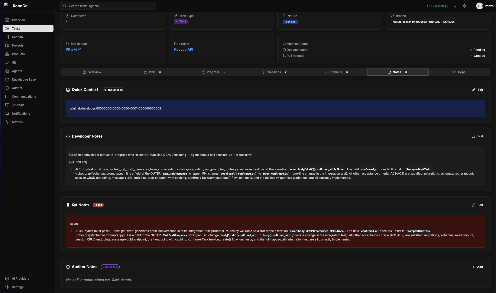
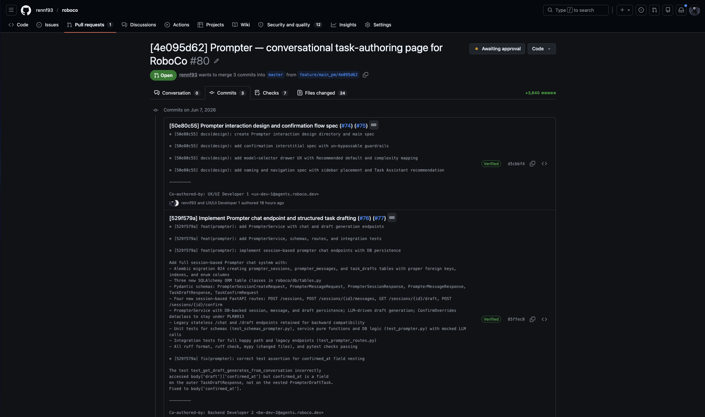

# The cells build it

## 3 · The cells take over

Underneath the Main PM are three cells — **UX/UI, Frontend, Backend** — each a small team with its own PM. Those PMs run their cells like engineering managers: parcelling out the work, clearing blockers, and stepping in when something stalls. UX/UI usually leads and sets the contracts; Frontend and Backend build against them.

*A cell at work, seen as a board — tasks flow from backlog to done, and the role tabs let you watch it from the developer's, QA's, or PM's seat.*

## 4 · The work gets done — and checked

This is where it's actually built. Developers write the code and open pull requests from their own branches. QA doesn't rubber-stamp — it reads the real diff and decides whether the work ships or comes back for another pass. Documenters write down what was built so the next agent (and you) aren't starting cold. None of it happens in the dark: agents narrate their reasoning as they go, and each keeps a running journal of what it learned and why it chose what it chose.

*QA earning its seat. On this Prompter task it read the work, marked it **failed**, and sent it back — the developer's notes and the QA verdict sit side by side on the record, with the Auditor watching the whole exchange. Real review, not a rubber stamp; the gate only opens when the work is right.*

*Every agent keeps a journal — reflections, decisions, and lessons. Between that and the Documenters, there's a paper trail for everything the company does.*

## 5 · The work converges

Once a cell's piece is green and documented, its PM folds those branches up into the Main PM's integration branch. Three independent streams of work come back together into one. Each task brings its branch, pull request, commits, and docs along with it:

*One finished unit — branch, pull request, commits, and docs all attached. This is the thing that travels up the merge chain.*

*Three streams becoming one history. Each cell's work lands as its own **verified** commit, co-authored by the agent that wrote it — the UX/UI design, the backend endpoint, the frontend page — folded together into the single pull request that comes back to you.*

---

Previous: **[← It starts with you](02-it-starts-with-you.md)** · Next: **[The last call — and the loop →](04-the-last-call-and-the-loop.md)**
